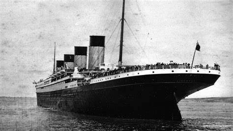

# Proyecto_titanic
 

## Exploración Detallada de Datos del Titanic

Adentrándonos en las profundidades de la tragedia del Titanic, este proyecto tiene como objetivo desentrañar historias fascinantes ocultas en los datos.

### Inicios del Proyecto:                        

Después de preparar el terreno con las bibliotecas esenciales, el proyecto comenzó con la carga ingeniosa del conjunto de datos del Titanic. Transformando los datos en un marco de trabajo, se sentaron las bases para la exploración.

### Limpieza y Preparación:                                    

La limpieza de datos es un arte, y aquí se llevó a cabo con destreza. Se abordaron valores nulos y duplicados, garantizando que los datos estuvieran en su mejor forma para análisis futuros.

### Análisis Profundo:                                                      

El proyecto no se detuvo en la superficie; cada columna fue diseccionada meticulosamente. Este análisis exhaustivo no solo buscaba patrones, sino también revelar las historias detrás de los pasajeros y los eventos que rodearon al Titanic.

### Visualización Dinámica:                                                   

Para sumergirse de lleno en los datos, se creó un informe interactivo en PowerBI. Esta herramienta proporciona una ventana dinámica para explorar los datos de manera intuitiva. Puede consultar aqui: https://app.powerbi.com/links/MiHWIfK9QH?ctid=8aebddb6-3418-43a1-a255-b964186ecc64&pbi_source=linkShare

### Invitación a una Exploración Continua:                                       

Este proyecto es solo el comienzo de una travesía más amplia. La vastedad de datos del Titanic invita a futuras exploraciones y descubrimientos. Cada comentario y sugerencia son como brújulas que guiarán este viaje.